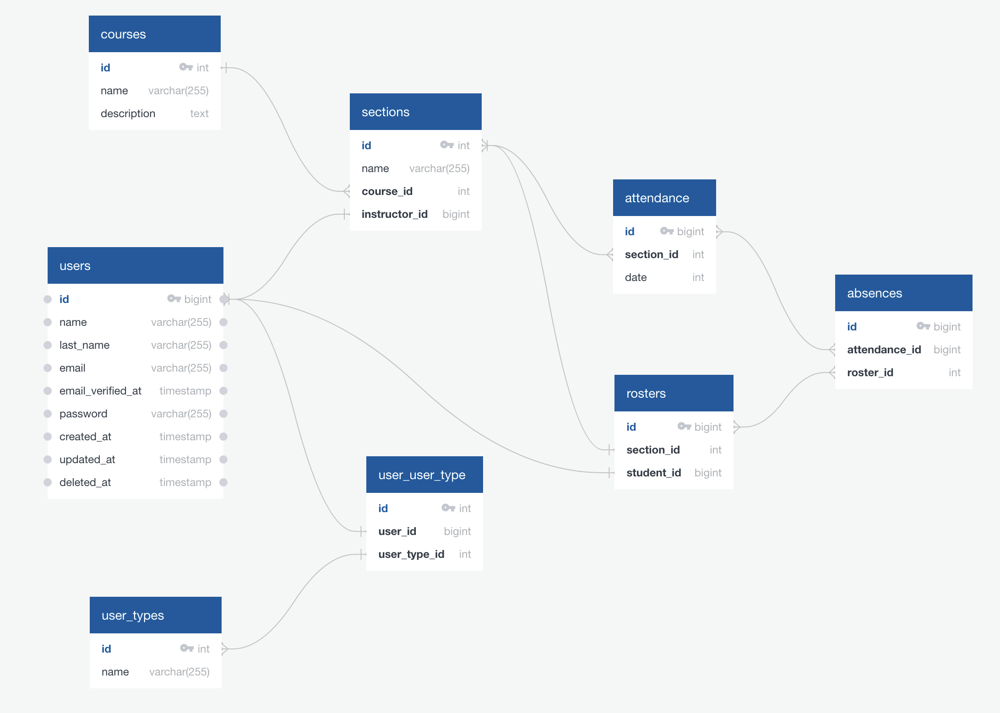

<p align="center"><a href="https://laravel.com" target="_blank"></a></p>

## Code Challenge Zipdev + Stanbridge

Backend API required to solve the Code Challenge defined by Zipdev + Stanbridge. This documentation includes all the
existing methods for the Application.

## The Problem

For a single course titled “Example Course,” display a roster of students to an instructor allowing the instructor to
record each student as present or absent.

## Requirements

- [x] Backend Laravel
- [x] Backend must persist present/absent status in a MySQL database
- [x] Write at least one feature or unit test in PHPUnit
- [ ] ~~NOT Over-engineering (keep it simple)~~ (I'm pretending to finish this challenge as a product).

> **Note:** Apologize for the delay in response to this challenge. As I explained, I participated in an event that
> doesn't allow me to work on anything else during the closing week.
> Please consider that I built the delivered version in just one day and a few hours (Git Commits as a probe of
> honesty).

## The Recommended (and Builded...) Solution

Build an Attendance platform that allows system users to handle the following:

### DB Schema



#### For Admin Users:

- User Administration
- Course Administration
- Section Administration
    - Roster Administration
    - Attendance Administration

#### For Professor Users:

- Section Attendance

#### For Student Users:

- Attendance Status

### Scope of the Solution

Because of the short time, we cover a few points of the Recommended Solution. The current project delivers the following
API endpoints:

- Courses
    - List all existing Courses.
    - Display course details.
- Sections
    - List all existing Sections.
    - Display section details.
- Attendance
    - Display all Attendance from a Section.
    - Add a new Attendance List.
- Absences
    - Add a new Absence to an Attendances List.
- Students
    - List all existing Students.
    - Add a new Student.
    - Display student details.
    - Edit an existing Student.
    - Delete an existing Student.

## How to use this repository?

- [ ] Clone the project.
  ```git clone https://github.com/ricardov03/roster-backend.git```
- [ ] Configure the Database. You can copy the .env.example.
- [ ] Migrate the Database. ```php artisan migrate:fresh --seed```
- [ ] Execute `php artisan l5-swagger:generate` to generate the Swagger documentation.
    - [ ] Visit the API Swagger documentation: `[base_url]/api/docs/v1`
- [ ] Extra: Import the API list to Postman or your favorite tool by using the following
  path: `[base_url]/storage/api-docs/api-docs.json`

Enjoy!

## Witch Laravel functions has been covered?

- Controllers
- Request
- Resources
- Models
- Policy (Not Implemented - Auth required.)
- Migrations
- Seeders
- Test

There's a single case of Enum used during the project development.

### Others Plus

- The current README documentation.
- Swagger Implementation.
- Use of Laravel Pint during the project for Code Formatting.
- Jetstream it's installed but not intended to use for the Challenge.
